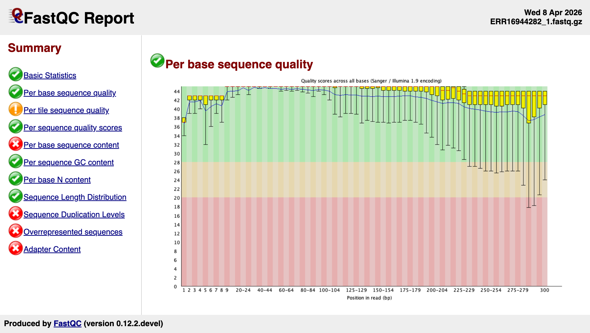

# FastQC (Rust)

An **unofficial** Rust rewrite of [FastQC](https://github.com/s-andrews/FastQC), the sequencing QC tool by Simon Andrews at the Babraham Institute.

> [!WARNING]
>
> **You should probably use the [official Java version](https://github.com/s-andrews/FastQC), not this one.**
>
> This project is to be a faithful rewrite of FastQC, with as-close-to identical outputs as possible. The hope is to [port improvements back upstream](https://ewels.github.io/FastQC-Rust/about/strategy/) until the rewrite provides no additional functionality or speed. It's basically a development fork in a different language, albeit with a Rust crate for folks building in that ecosystem.
>
> For regular use, it's probably best to stick with the official Java version from [Babraham](https://www.bioinformatics.babraham.ac.uk/projects/fastqc/) or [GitHub](https://github.com/s-andrews/FastQC).



## Why does this exist?

Two reasons, both secondary to the original tool:

- **Upstream contributions** — a sandbox for prototyping improvements (performance, bug fixes, UI) that get [ported back to Java FastQC as PRs](https://ewels.github.io/FastQC-Rust/about/strategy/). The goal is to make the canonical tool better, not replace it.
- **Rust crate** — published as [`fastqc-rust`](https://crates.io/crates/fastqc-rust) for developers building bioinformatics tooling in the Rust ecosystem. `fastqc_data.txt` and `summary.txt` are byte-identical to the Java version — see the [equivalence report](https://ewels.github.io/FastQC-Rust/about/equivalence/).

Currently tracking upstream Java FastQC version `0.12.1`. See [`UPSTREAM.toml`](UPSTREAM.toml) for details.

## Installation + Usage

### From a release binary

Download prebuilt binaries from the [Releases](https://github.com/ewels/FastQC-Rust/releases) page.

```bash
# Install (Linux x86_64 example -- see docs for all platforms)
curl -fsSL https://github.com/ewels/FastQC-Rust/releases/download/v0.12.1/fastqc-linux-x86_64.tar.gz | tar xz --strip-components=1
sudo mv ./fastqc /usr/local/bin/

# Run
fastqc sample.fastq.gz
```

### Using Docker

```bash
docker run ghcr.io/ewels/fastqc-rust:dev fastqc sample.fastq.gz
```

### With Cargo

```bash
cargo install fastqc-rust
fastqc sample.fastq.gz
```

### Building from source

```bash
# Clone + build
git clone https://github.com/ewels/FastQC-Rust.git
cd FastQC-Rust
cargo build --release

# Run
./target/release/fastqc sample.fastq.gz
```

## Usage

```bash
# Analyze a FASTQ file
fastqc sample.fastq.gz

# See all options
fastqc --help
```

## Equivalence testing

This project maintains strict equivalence with the upstream Java FastQC. CI runs automated comparison of text output and chart images against stored Java reference data.

```bash
# Run equivalence tests locally (requires uv)
cargo build --release
uv run tests/equivalence/compare.py --binary ./target/release/fastqc
```

This generates an interactive HTML report with text diffs and side-by-side image comparison. See `tests/equivalence/` for details.

## Upstream tracking

`UPSTREAM.toml` pins the Java FastQC version this rewrite tracks. A nightly CI job checks for new upstream releases and automatically creates a GitHub issue when one is found.

## License

GPL-3.0 — see [LICENSE](LICENSE).

## Acknowledgments

FastQC was originally written by Simon Andrews at the [Babraham Institute](https://www.bioinformatics.babraham.ac.uk/).

Please cite that tool when using outputs from this FastQC-Rust rewrite.
