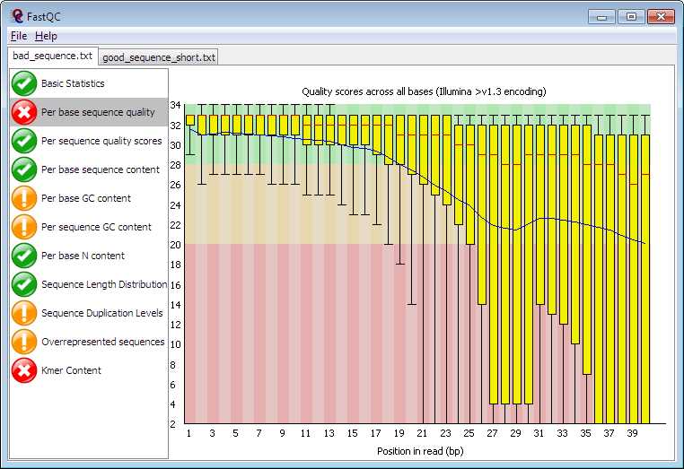

# FastQC (Rust)

A Rust rewrite of [FastQC](https://github.com/s-andrews/FastQC), a quality control tool for high-throughput sequencing data.



This is a complete rewrite of the original Java FastQC application in Rust. It produces **byte-identical text output** (`fastqc_data.txt`, `summary.txt`) to the Java version, while being significantly faster and distributed as a single static binary.

Currently tracking upstream Java FastQC version — see [`UPSTREAM.toml`](UPSTREAM.toml) for details.

## Installation

### From source

```bash
cargo install fastqc-rust
```

### From a release binary

Download prebuilt binaries from the [Releases](https://github.com/ewels/FastQC/releases) page.

### Building from source

```bash
git clone https://github.com/ewels/FastQC.git
cd FastQC
cargo build --release
# Binary at ./target/release/fastqc
```

## Usage

```bash
# Analyze a FASTQ file
fastqc sample.fastq.gz

# Specify output directory
fastqc -o results/ sample.fastq.gz

# Analyze multiple files in parallel
fastqc -t 4 *.fastq.gz

# BAM input
fastqc --format bam aligned.bam

# See all options
fastqc --help
```

### Key options

| Flag | Description |
|------|-------------|
| `-o, --outdir DIR` | Output directory (must exist) |
| `-f, --format FORMAT` | Force format: `bam`, `sam`, `bam_mapped`, `sam_mapped`, `fastq` |
| `-t, --threads N` | Number of parallel file processing threads |
| `--casava` | CASAVA 1.8+ mode (exclude filtered reads) |
| `--nano` | Nanopore Fast5 mode |
| `--nogroup` | Disable base grouping for reads > 50bp |
| `--expgroup` | Use exponential base groups |
| `-k, --kmers N` | Kmer size 2-10 (default: 7) |
| `--min_length N` | Minimum sequence length to report |
| `--extract` | Unzip output after creation |

## Equivalence testing

This project maintains strict equivalence with the upstream Java FastQC. CI runs automated comparison of text output and chart images against stored Java reference data.

```bash
# Run equivalence tests locally (requires uv)
cargo build --release
uv run tests/equivalence/compare.py --binary ./target/release/fastqc
```

This generates an interactive HTML report with text diffs and side-by-side image comparison. See `tests/equivalence/` for details.

## Upstream tracking

`UPSTREAM.toml` pins the Java FastQC version this rewrite tracks. A nightly CI job checks for new upstream releases and automatically creates a GitHub issue when one is found.

## License

GPL-3.0 — see [LICENSE](LICENSE).

## Acknowledgments

FastQC was originally written by Simon Andrews at the [Babraham Institute](https://www.bioinformatics.babraham.ac.uk/). This Rust rewrite aims to be a faithful, high-performance reimplementation.
